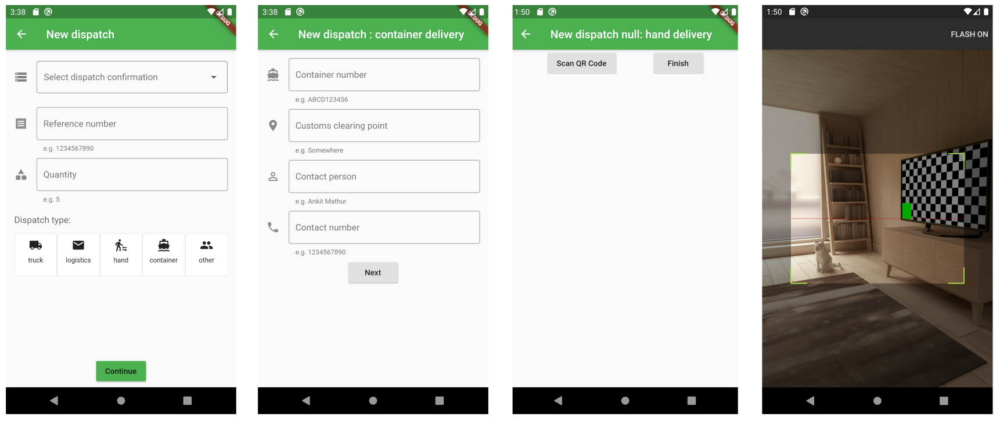

# Mobile Application Demo

Hello! I started learning Flutter a month ago and this is my first Android app. I am building this mobile application for a company that sells appliances, and they need an inventory-tracking system for its workers. This application will be used in the dispatch stage, where appliances have been manufactured and need to be sent into the delivery process. 

Here is a basic description of what I have completed so far, as well as what else needs to be completed. 

## Home Page 
This presents the information most relevant to the dispatcher. 

The list in the home page are dispatches that need to be dispatched. This information is reading from a local json file after the dispatcher has entered information of dispatches. 
1. dispatch type (truck, logistics, container, hand, or other) 
2. reference number
3. number of appliances in this dispatch 
The small arrow represents how each cell can be clicked to view more information of specific dispatches. 

The dashboard shows a pie chart with information of how many dispatches have arrived to customers, and how many are still in delivery. 

The history page follows a similar format as the home page's list. It contains information of dispatches that have already been dispatched from the factory. 

## New Dispatch Form 
When appliances need to be dispatched to a customer, the dispatcher needs to fill out a form. Currently, this data is written to a local json file, so that it can be read on the home page to display dispatch information. 
Page 1: Enter basic information about the dispatch.
Page 2: Enter contact information based on the selected dispatch type.
Page 3 & 4: Each appliance has a QR code attached, it needs to be scanned in order to keep track of the inventory.

## Next steps 
1. Since this is an ongoing project, I am still working on adapting to Hive for the local json storage. 
2. The company will roll out alpha testing with some workers to find issues regarding the app. 
3. After improving the app based on those testing, I will connect the data to the backend by using Firebase. 
4. I will create a log in page and user authentication system so that dispatch information is attached to specific workers. 
5. In the future, I will also work on more versions of the app for other roles in the company. For example, workers in manufacturing need to scan each appliance's QR code to enter the information in the inventory. People who are receiving or delivering dispatches also need to log their location and progress. 
